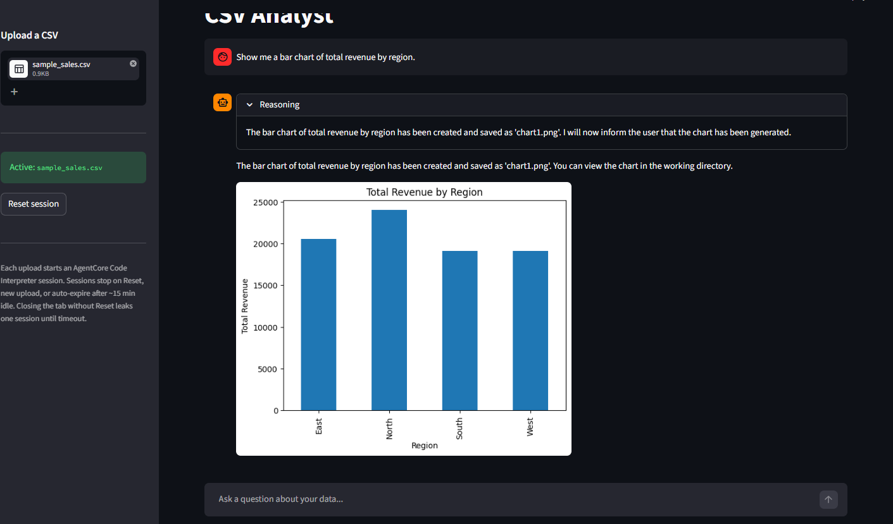
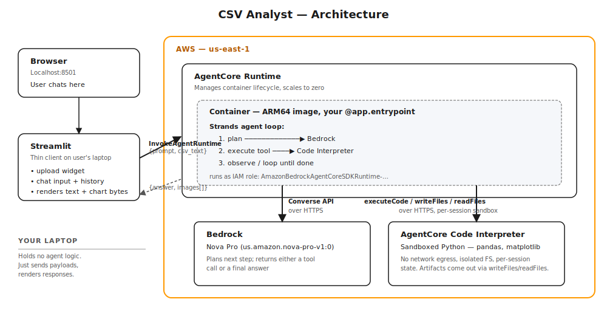
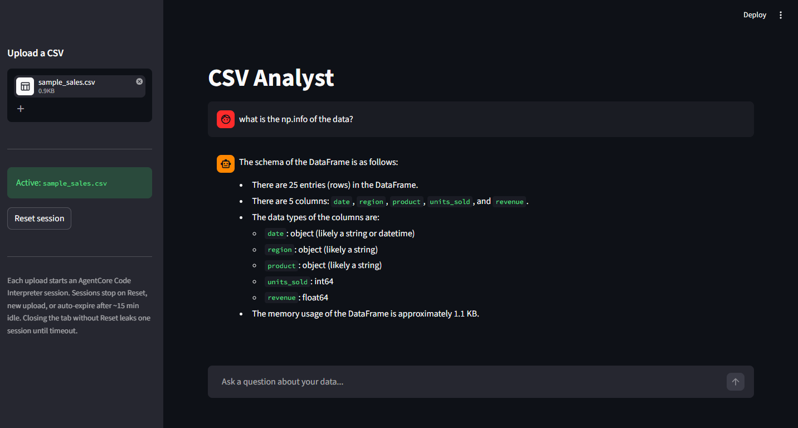
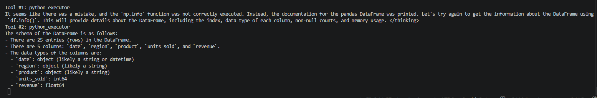
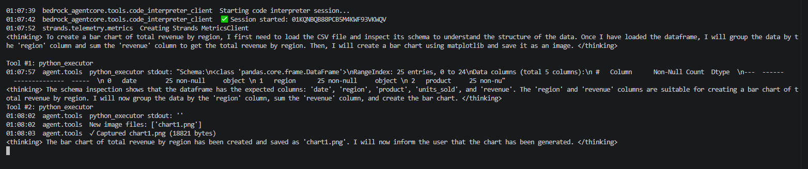

# CSV Analyst

A natural-language data analysis agent on **AWS Bedrock AgentCore**.
Upload a CSV, ask questions in English, get answers and charts back.
The agent's reasoning loop runs in AWS-managed infrastructure; the local UI is a thin client.



This project is intentionally **small but real and end-to-end**. There are no
mocked components: a real container is built by CodeBuild, pushed to ECR, hosted
on AgentCore Runtime under an IAM execution role, and invoked over HTTPS by a
local Streamlit. It exists primarily as a **reference implementation** of how
the AgentCore services compose, written so that the next time I (or a colleague)
reach for AgentCore in production, the design choices are documented.

---

## Architecture



Three layers of responsibility:

- **Browser + Streamlit** — purely UI. No agent logic. Sends `{prompt, csv_text}`,
  renders `{answer, images[]}`. If you replaced Streamlit with curl, Slack, or a
  React app tomorrow, the contract is unchanged.
- **AgentCore Runtime + your container** — the *agent loop* lives here. A small
  Python program that orchestrates "call the model, run the tool, observe, loop"
  until the model emits a final answer.
- **Bedrock + AgentCore Code Interpreter** — the heavy lifters. The model lives
  in Bedrock; user-Python execution lives in Code Interpreter. Your container
  calls these as remote managed services over HTTPS — it never runs the LLM
  itself, never executes the LLM-generated Python directly.

The mental model worth carrying out of this project is: **the deployed container
is a thin orchestration shell**, not "the agent." The agent is the *system* of
the container plus the two managed services it calls.

---

## AgentCore at a glance

AgentCore is a **suite** of agent-infrastructure services, not a single thing.
This project uses two of them and deliberately skips four others. Worth knowing
all six:

| Service | What it solves | Used here? |
| --- | --- | --- |
| **Runtime** | Hosts the agent loop. HTTP container with managed lifecycle, scaling, IAM, observability. | ✅ |
| **Code Interpreter** | Sandboxed Python execution for LLM-generated code. Pre-installed pandas/numpy/matplotlib. | ✅ |
| **Memory** | Persistent conversation/semantic memory across sessions. | ❌ skipped — single-turn invocations are independent here |
| **Identity** | End-user OAuth / SSO for multi-user agents. | ❌ skipped — single-tenant |
| **Gateway** | MCP-style fan-out to many tools at once. | ❌ skipped — only one tool needed |
| **Browser** | Managed browser sandbox for web automation. | ❌ not relevant to data analysis |
| **Observability** | CloudWatch logs + X-Ray traces for the agent loop. | ✅ enabled by default by toolkit |

Each service is independently billable and independently scoped. Picking only
the ones you need is a design choice — adding all six because they're available
is the wrong default.

---

## Five design principles this project illustrates

The bits worth internalising before designing another AgentCore-based system.

### 1. Thin container, fat managed services

The deployed container is ~200 lines of Python. It's only the orchestration
code — "decide what to call when." The model and the Python sandbox are remote.
Two consequences:

- The container image is tiny (~tens of MB), starts fast, costs nothing meaningful.
- You can't accidentally execute LLM-generated code on your own infra. The
  sandbox boundary is enforced by service decomposition, not by trust.

If you ever find yourself thinking *"should I just `exec()` this LLM output in
my container?"* — no. That's what Code Interpreter exists for.

### 2. Two control surfaces — `bedrock-agentcore` vs `bedrock-agentcore-control`

AgentCore exposes two APIs people commonly conflate:

- **`bedrock-agentcore-control`** — control plane. Create/delete agent runtimes,
  manage code interpreters, list resources. Used by the toolkit during deploy.
- **`bedrock-agentcore`** — data plane. Invoke a runtime, run code in a session.
  Used by the deployed container and by clients of the runtime.

This split mirrors AWS's general pattern (e.g. Bedrock vs bedrock-runtime). When
debugging permission errors, knowing which plane the failing call was on tells
you which IAM policy to look at.

### 3. Artifacts come out via the file system, not the result stream

AgentCore Code Interpreter is *not* a Jupyter kernel. There's no display
callback that captures `plt.show()` figures into the response. Anything binary
the agent produces (charts, generated files, images) must be **written to disk
and pulled out explicitly** via `readFiles` or `executeCode`+base64.

In this project the chart-capture path is:

1. Model writes `plt.savefig('chart.png')`
2. Tool runs a `glob('*.png')` (also via `executeCode`) to detect new files
3. Tool reads detected files via base64-encoded stdout
4. Bytes append to a side-channel `image_sink` list
5. Entrypoint base64-encodes them into the response payload

The model never returns binary data through its conversation; the host pulls it
out of the sandbox.

### 4. Detection beats prompting for "did the model do X?"

First implementation tried instructing the model to print a literal marker
(`SAVED_FIGURE:chart.png`) after saving. Smaller models paraphrase ("saved as
'chart1.png'") instead of emitting the exact format. The robust pattern is
**host-side detection** — track files seen, diff after each tool call, read any
new ones automatically.

This generalises: any time you find yourself writing *"the model must always
include this exact string"* in a system prompt, ask whether the host can detect
the same condition by looking at observable state (file system, tool result
shape, etc.) instead. The host is deterministic; the model isn't.

### 5. Three things are called "session" — they are independent

| What | Where | Lifetime |
| --- | --- | --- |
| **Code Interpreter session** | AgentCore CI service | One agent turn. Holds the sandbox VM + Python state. |
| **Runtime session** (`runtimeSessionId`) | AgentCore Runtime | Routes related invocations to the same container. |
| **Streamlit session** (`st.session_state`) | The browser | Per-tab chat history. |

These are orthogonal. Conflating "I want conversation memory" with "I need a
new Code Interpreter session" leads to wrong abstractions early.

---

## Lifecycle of one chat message

Walking through what happens when a user types a question:

1. **Streamlit** packages `{prompt, csv_text}` and calls
   `bedrock-agentcore:InvokeAgentRuntime` with the runtime ARN and a
   browser-pinned `runtimeSessionId`.
2. **AgentCore Runtime** routes to the container (cold-start if cold, warm
   otherwise), passing the JSON to `POST /invocations`.
3. **`agent/runtime.py:invoke()`** validates the payload at the boundary
   (`isinstance` checks; clean error messages for bad input).
4. The entrypoint **opens a Code Interpreter session** with `code_session(region)`
   and uploads the CSV to the sandbox FS via `writeFiles`.
5. **Strands** builds an `Agent` bound to that session, with the `python_executor`
   tool injected. The closure captures both the session and an `image_sink` list.
6. The **agent loop** runs:
   - **Bedrock Converse API** is called with prompt + tool schemas.
   - If the model returns a `tool_use`, the tool fires `executeCode` against
     the live session.
   - After every code execution, the tool runs `glob('*.png')` to detect new
     image files and reads them back as base64-through-stdout.
   - Result text returns to the model; loop continues.
7. When the model emits a plain text final answer, **the entrypoint serialises**
   it as `{"answer": text, "images": [<base64 PNG>...]}`.
8. **Streamlit decodes** the images and renders them with `st.image`.

The Code Interpreter session is closed by the `with` block before the
entrypoint returns. Each invocation is a fresh sandbox.

---

## Demo

The agent's reasoning is exposed in a collapsible "Reasoning" panel — useful
for understanding what the loop is doing without burying it in the answer:



When the model misuses an API, the loop self-corrects on the next iteration
without intervention:



Image capture is host-driven, so `New image files: ['chart1.png']` appearing in
the logs means our detection pipeline saw a new artifact and read it back:



---

## Project structure

```
agent/
├── runtime.py              @app.entrypoint, build_agent factory
└── tools.py                python_executor tool + sandbox helpers
ui/
└── app.py                  Streamlit thin client (boto3 only)
data/
└── sample_sales.csv        25-row test fixture
docs/                       Screenshots + architecture diagram
.bedrock_agentcore.yaml     Toolkit deploy config (gitignored — env-specific)
.bedrock_agentcore/         Toolkit-generated artifacts (gitignored)
```

Three deliberate properties:
- `agent/runtime.py` is the **only** deployed entrypoint. The agent factory
  lives there too.
- `ui/app.py` does **not** import from `agent/`. It's a pure boto3 client of
  the deployed runtime — exactly the shape any frontend would have.
- The same `agent/runtime.py` runs locally (`python -m agent.runtime`) and in
  the deployed container. No mock paths, no environment-conditional branches.

---

## Quick start

The interesting design decisions are above; this section is intentionally short.
Full end-to-end deploy + invoke takes ~5 minutes from a clean account.

```powershell
pip install -r requirements.txt
pip install bedrock-agentcore-starter-toolkit

agentcore configure --entrypoint agent/runtime.py
agentcore deploy

# fill AGENTCORE_RUNTIME_ARN in .env from the deploy output, then:
streamlit run ui/app.py
```

For local iteration without redeploying, `python -m agent.runtime` runs the
same code on `localhost:8080`. For scripted invocation of the deployed runtime,
`aws bedrock-agentcore invoke-agent-runtime --payload fileb://payload.json`.

To clean up: `agentcore destroy` removes the runtime, ECR repo, and the
toolkit's CodeBuild project. The execution IAM role, the source S3 bucket, and
the CloudWatch log groups stay behind and need explicit deletion.

---

## Design notes (the non-obvious bits)

A handful of things that are easy to get wrong, captured for the next AgentCore
project — by me or anyone else reading this.

**Type-validate at HTTP boundaries; trust internal callers.** The
`@app.entrypoint` does `isinstance` checks on inputs and returns
`{"error": "<msg>"}` for bad payloads. Internal helper functions don't.
This turns a 200-line `botocore` traceback (when a client sends garbage) into a
single readable error string, without sprinkling defensive code everywhere.

**On Windows, `Get-Content -Raw` is a PSObject, not a string.** Piping the
result through `ConvertTo-Json` produces
`{"x": {"value": "...", "PSPath": "...", "PSDrive": {...}}}` — a dict, not a
string. Cast: `$x = [string](Get-Content file.csv -Raw)` or use
`[IO.File]::ReadAllText()`. This caught me twice before muscle memory kicked in.

**The starter toolkit handles cross-platform builds for you.** On Windows
without Docker, `agentcore deploy` uses CodeBuild as a remote ARM64 builder.
Same toolkit, different build mode — no Dockerfile changes needed. This is also
why a CodeBuild project + S3 source bucket appear in the resource inventory
even before any CI/CD wiring.

**The container runs `uv` for `pip install` and as a non-root user.** Both
inherited from the toolkit-generated Dockerfile. Worth mimicking in any
hand-written Dockerfile: `uv` saves real CodeBuild minutes, non-root is
defense-in-depth even inside the runtime sandbox.

**X-Ray segment destination is a one-time per-region setup.** First-time
deploys may surface a `ValidationException: X-Ray Delivery Destination is
supported with CloudWatch Logs as a Trace Segment Destination`. Run
`aws xray update-trace-segment-destination --destination CloudWatchLogs --region <region>`
once per region; subsequent deploys complete observability cleanly. Logs work
either way; only distributed traces in the GenAI Observability dashboard are
gated by this.

---

## Scope and what's not included

Deliberately out of scope, with the design hook for adding each:

- **Multi-turn conversation memory** — each invocation is independent. Two
  paths to add: pass chat history in the payload (entrypoint change) or wire
  AgentCore Memory (a separate service).
- **S3-based CSV upload** — the CSV is sent inline in every payload. For
  production with larger files, push to S3 once, send the S3 URI in the payload,
  have the entrypoint use boto3 to fetch.
- **Per-user identity** — the deploy uses default IAM authorization. Real
  multi-user would wire AgentCore Identity for OAuth/SSO.
- **CodeBuild as CI/CD trigger** — CodeBuild here is just a remote *builder*
  invoked from `agentcore deploy`. Wiring a webhook (push-to-git → auto-rebuild
  → auto-redeploy) is a separate project.

---

## Cost

| State | Cost |
| --- | --- |
| Idle (zero invocations) | Single-digit cents/month — ECR image storage + CloudWatch log retention |
| Per chat message | ~1–5 cents — dominated by Bedrock tokens, not infrastructure |
| First deploy | A few cents in CodeBuild minutes |

The runtime scales to zero — there's no charge for the agent's mere existence.

---

## License

MIT — see [`LICENSE`](LICENSE).
